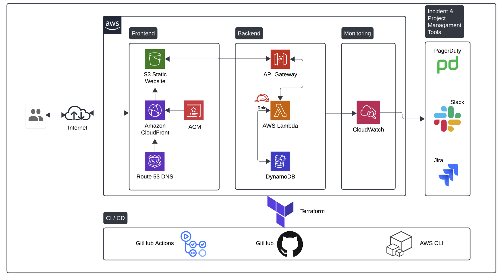

# personal-website-backend

For more details see:
https://cloudresumechallenge.dev/docs/the-challenge/aws/

IaC repo defining infra related to my personal website for both the backend & frontend

## Service Configurations

### API Gateway

- Acts as a frontdoor for static website to access backend services, Provides a centralised platform to create and manage various types of APIs, rate limiting can be implemented here

### CloudFront (CDN)

- Sits infront of backend services, used to cache content (in this case the frontend) in global network of edge locations to deliver it to users faster and reduce load on origin servers

### S3 Bucket (Frontend host)

- Hosts static HTML page, cost effective scalable solution for client-side applications as it doesn't require its own dedicated host

### ACM (AWS Certificate Manager)

- Provision, manage and deploy public and private SSL/TLS certificates to secure webtraffic for AWS services and applications, authenticating the websites identity and encrypt data between users & the website, required for HTTPS

### Lambda functions (Python)

- Interacts with API Gateway & DynamoDB, allowing for communication with DynamoDB & the static website, low cost and scalable with demand.

### Dynamo DB Table

- Stores visitor count

