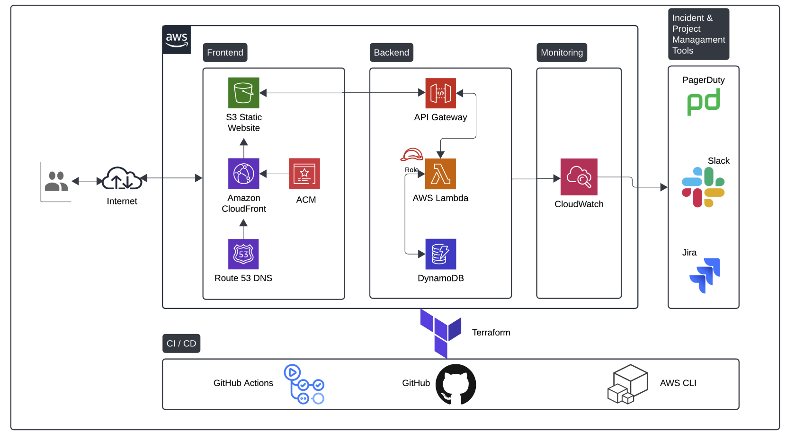

# Personal Website Backend

Terraform infrastructure as code (IaC) repository for my personal website, implementing the [AWS Cloud Resume Challenge](https://cloudresumechallenge.dev/docs/the-challenge/aws/).

This project defines the complete infrastructure for both backend and frontend components of the website.

## Service Configurations

### API Gateway

- Acts as a frontdoor for static website to access backend services, Provides a centralised platform to create and manage various types of APIs, rate limiting can be implemented here

### CloudFront (CDN)

- Sits infront of backend services, used to cache content (in this case the frontend) in global network of edge locations to deliver it to users faster and reduce load on origin servers

### S3 Bucket (Frontend host)

- Hosts static HTML page, cost effective scalable solution for client-side applications as it doesn't require its own dedicated host

### ACM (AWS Certificate Manager)

- Provision, manage and deploy public and private SSL/TLS certificates to secure webtraffic for AWS services and applications, authenticating the websites identity and encrypt data between users & the website, required for HTTPS

### Lambda functions (Python)

- Interacts with API Gateway & DynamoDB, allowing for communication with DynamoDB & the static website, low cost and scalable with demand.

### Dynamo DB Table

- Stores visitor count

## Architecture



## Project Structure

```
.
├── main.tf                 # Root module - orchestrates all infrastructure
├── variables.tf            # Root-level variable definitions
├── outputs.tf              # Root-level outputs
├── terraform.tf            # Terraform and provider configuration
├── modules/                # Reusable Terraform modules
│   ├── acm/               # SSL/TLS certificate management
│   ├── apigateway/        # API Gateway configuration
│   ├── cloudfront/        # CloudFront CDN
│   ├── dynamodb/          # DynamoDB tables
│   ├── lambda/            # Lambda functions
│   └── s3/                # S3 bucket for static hosting
├── environments/          # Environment-specific configurations
├── lambda_code/           # Python code for Lambda functions
├── scripts/               # Utility scripts
└── docs/                  # Documentation and diagrams
```

## Prerequisites

- [Terraform](https://www.terraform.io/downloads.html) >= 1.2
- AWS CLI configured with appropriate credentials
- AWS account with necessary permissions

## Usage

1. Initialize Terraform:
   ```bash
   terraform init
   ```

2. Review the planned changes:
   ```bash
   terraform plan
   ```

3. Apply the infrastructure:
   ```bash
   terraform apply
   ```

4. Destroy the infrastructure (when needed):
   ```bash
   terraform destroy
   ```
